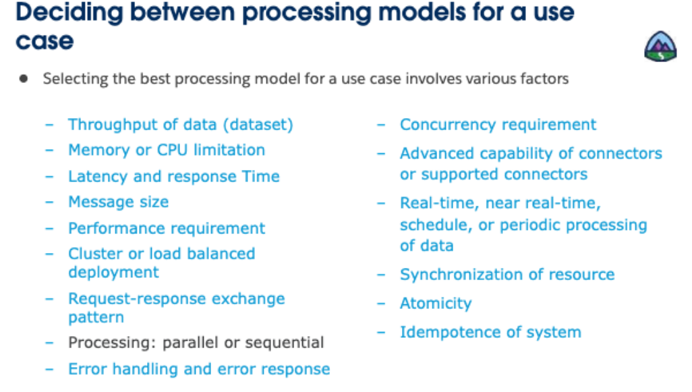

# 4. Choosing appropriate Mule 4 processing models

### Introducing Mule event processing models and options

- **********Processing models********** collect together options and behaviors related to Mule event processing by using Mule application components and flow within a Mule Runtime
- Event processing by ****Mule scopes****  can be modeled to describe
    - How Mule components can be process a copy of the same Mule event in parallel and then combined the results
    - How Mule components process a Mule event that contains a collection of records, sequentially or in parallel
- Event processing by ********************************Mule connectors********************************  can be modeled to describe
    - The behavior of inbound Mule event sources at the beginning of a flow
    - How message queuing connectors process Mule events

- These models describe the **************************************event-processing************************************** behavior of
    - **********************************Non-blocking********************************** and **********************concurrent********************** Mule event processing by Mule runtime
    - **********************Synchronous********************** Mule event processing by Mule components and flows
    - **************************Asynchronous************************** Mule event processing by Mule components and flows
    - ****************************************Parallel processing****************************************  of Mule event by Scatter-Gather components
    - ******************************************Streaming processing****************************************** of larger-than-memory Mule events
    - **************Iterative processing************** of Mule events containing collections of records
    - **********************Read-time********************** and ********scheduled******** event processing of Mule events
    

---

### What is reactive programming?

- A declarative programming paradigm that combines ************************concurrency************************  with **********event-based********** and **********************asynchronous**********************  systems
- Popular with web-based, distributed system
- Reactive programming in Mule runtime is an internal product detail with automatically improves performance
    - Typically does not involve any tuning by developers or administrators
- U**s**e the best ideas from the ************Observer pattern,************  the ****Iterator pattern,****  and  ************functional programming************
- Deal with an ongoing and building **event stream**
    - Rather than one complete, static, all-in-memory data collection
- Is an **********asynchronous, non-blocking,********** and declarative programming style
    - Avoids the “callback hell” of the Observer pattern
    
    [Blocking vs Non-blocking Languages](https://www.youtube.com/watch?v=aVLjh8A6OGU)
    

### Mule incorporates handling of back pressure

- Mule application are automatically configured to handle back pressure va internal Mule runtime details.
    - Back pressure **************************automatically************************** slow down a flow’s event source by sending a ********************back pressure signal********************  when event consumers later in the flow are being overwhelmed by the rate of events
        - For example, if there are too many concurrent requests to an HTTP Listener, then the HTTP Listener might return a  ************503 Server busy************  error code
        - Or, if a JMS Listener is running out of memory, the flow might not acknowledge receipt of received messages to the JMS broker, which slows down the JMS Listener receiving new messages until resource are available
- Back pressure can be further influenced ****************manually****************
    - By setting the **************************maxConcurrency************************** attribute of a flow
    - Use with caution because this interferes with the back pressure behavior built into Mule runtime
    

### Mule runtime uses a non-blocking and reactive processing model

- **********************Non-blocking********************** is a central theme in Reactive Principle
- Non-blocking is the norm in Mule
    - Every flow has top-level support for **************************non-blocking************************** operations
    - Although many connector operations are blocking, Mule runtime makes it easy to develop  ************non-blocking operations************
    - For the Mule connector that is implemented using a ************non-blocking IO library, thread do not block,************  waiting for ******************************************************IO Intensive operations****************************************************** to complete
        - For example, the HTTP Connector is non-blocking because it is implemented on top of a non-blocking HTTP client library
    - The developer does  **********not**********  need to assign a **********************************************processing strategy**********************************************  to each flow
    
    
    
    Thread pools are no longer configurable at the level of a Mule application. We now have three centralized pools:
    
    - CPU_INTENSIVE
    - CPU_LITE
    - BLOCKING_IO

****Typical thread-switching scenario****

- *SHARED_GRIZZLY Thread #10* receives the HTTP Listener request.
- *CPU_LITE Thread #8* caters to the handoff between the HTTP Listener and the Database select operation.
- *BLOCKING_IO Thread #5* must make the call to the database server and then wait for the result set to be sent back.
- A thread from CPU_LITE is needed for the Logger operation but Scheduler optimization allows for *CPU_LITE Thread #2* to also be used for the handoff before and after it.
- *CPU_INTENSIVE Thread #16* executes the DataWeave transformation. DataWeave always takes a thread from this pool regardless of whether blocking actually occurs.
- A similar optimization occurs on the second Logger and handoffs with *CPU_LITE Thread #1* also making the outbound HTTP Requester call.
- *DEDICATED GRIZZLY Thread #2* receives the HTTP Requester response.
- There is an optimization on the response after flow completion: *CPU_LITE Thread #7* does the handoff back to the flow source (HTTP Listener) and also executes the response to the client.

****Try scope with Transaction****

Here the Transactional Try scope mandates the use of a single thread. This will always be from the BLOCKING_IO pool regardless of what type of operations are contained within the scope.

****JMS Transactional****

In this scenario the whole flow is transactional and requires a single thread from BLOCKING_IO up to the HTTP request.

****JMS transactional with Async scope****

In this scenario, the Async scope ends the transaction and normal thread selection applies.

---

### Introducing streaming processing models

- ****************Streams**************** are data structures that provide efficient processing of large data objects, such as files, documents, and records, by processing data ******************************************************continuously as it arrives.******************************************************
    - Compared with other in-memory data structures that ************hold all values in memeory************ before computing
    - Allow large datasets to be processed without **************************************running out of memory**************************************
- The running ****************************automatically**************************** streams large data payloads without any special configuration
- Default streaming varies for Mule Enterprise Edition and Mule Kernel

### How connectors support repeatable streams

- Normally, streams can be consumed once by one consumer, but repeatable streams can be consumed more than once by multiple consumers.
- Every component in Mule that returns an InputStream or a Streamable collection supports repeatable streams.
- Some connectors that support repeatable streams include
    - File/SFTP/FTP/FTPS
    - DB
    - HTTP
    - Sockets
    - Salesforce
    
    
    
    ### Explanation
    
    
    
    
    
    
    
    
    

## Repeatable in File stored

